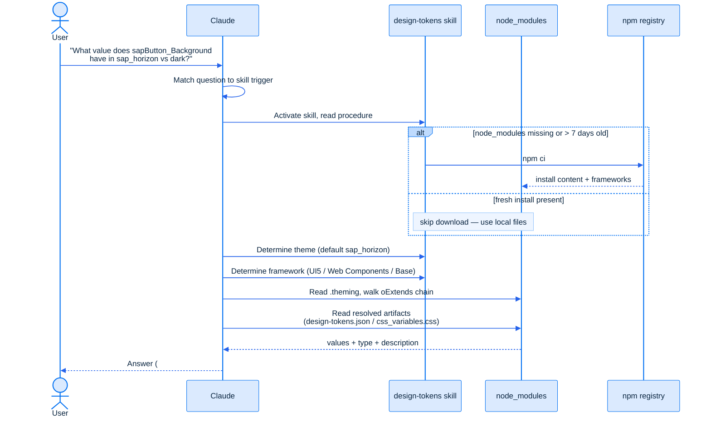

# UI Theme Designer Plugin

General plugin for coding agents working with the UI theme designer [SAP Help pages](https://help.sap.com/docs/btp/sap-business-technology-platform/sap-ui-theme-designer) and the SAP Design System — including [SAP Fiori design tokens](https://github.com/SAP/theming-base-content).

## Key Features

### 📋 Skills

#### ui-theme-designer-help

Answers how-to get started with UI theme designer and conceptual questions about UI theme designer on BTP:

- Initial setup, including user/role management
- Creating, editing, and publishing themes
- Quick, detailed, and expert theming workflows
- Transporting themes, fallback themes, theme sets
- Integration with SAP Build Work Zone, S/4HANA, SAPUI5, SAP GUI
- Troubleshooting and error messages

#### ui-theme-designer-design-tokens

Answers questions about the SAP Design System and SAP Fiori design tokens:

- Which themes exist (e.g. `sap_horizon`, `sap_fiori_3`) and what value a parameter has in each
- How parameters inherit and extend across the theme chain via `.theming` files
- Which parameters a specific UI component consumes — for [SAPUI5/OpenUI5](https://github.com/UI5/openui5), [UI5 Web Components](https://github.com/UI5/webcomponents), and [Fundamental Styles](https://github.com/SAP/fundamental-styles)
- Which hard-coded values in your custom CSS can be replaced by theming parameters, so your styles stay in sync with the SAP Design System and adapt to every theme

## Installation

### For Claude

```sh
claude plugin install ui-theme-designer@claude-plugins-official
```

See [Claude by Anthropic: ui-theme-designer](https://claude.com/plugins/ui-theme-designer).

### For GitHub Copilot

```sh
copilot plugin install ui-theme-designer@awesome-copilot
```

See [Awesome GitHub Copilot: ui-theme-designer](https://awesome-copilot.github.com/plugin/ui-theme-designer/).

### For other coding agents

If your coding agent doesn't support plugins, install the skills directly using the [skills](https://www.npmjs.com/package/skills) package:

```bash
npx skills add SAP/ui-theme-designer-plugins-for-coding-agents
```

See [The Agent Skills Directory: SAP/ui-theme-designer-plugins-for-coding-agents](https://www.skills.sh/?q=SAP/ui-theme-designer-plugins-for-coding-agents).

## How Does the Design Tokens Skill Work?

The `ui-theme-designer-design-tokens` skill does not rely on the agent's training data for parameter values. Instead, it works against the actual source-of-truth artifacts published on npm. When your question matches one of the skill's triggers, the agent activates the skill and reads its procedure. If the local `node_modules` are missing or older than seven days, the skill runs `npm ci` to pull the current theming base content and framework packages; otherwise it reuses the files already on disk. It then determines the relevant theme (defaulting to `sap_horizon`) and framework (UI5, UI5 Web Components, or the base content), follows the `.theming` inheritance chain via the `oExtends` links, and reads the resolved artifacts — `design-tokens.json` or `css_variables.css`. The answer it returns is grounded in those files, including each parameter's value, type, and description.



## Examples

Examples showing in which situations the UI Theme Designer plugin can help you.

### Develop a Custom Component Using Design Tokens of Similar Components

**Situation:** You are building a custom component library and want to add a new component that looks consistent with the SAP Design System. The UI technology doesn't matter — this works with UI5, UI5 Web Components, or any other framework. To make the component themable, you want to reuse the SAP design tokens that standard components of the same type already use.

**Example:** You want to build a `ThemeCard` component that displays a preview of an SAP theme. Instead of guessing which parameters to use, ask:

> _"I want to develop a card control to display a preview of a SAP theme. Please list existing card parameters I can use in the CSS."_

**Result:** The agent returns the theming parameters that the UI5 Web Components `Card` uses, grouped by purpose. UI5 Web Components serve as the reference implementation of the SAP Design System, so the skill defaults to them when no UI framework is specified — for example:

| Purpose | Parameters |
|---|---|
| Background & border | `--sapTile_Background`, `--sapTile_BorderColor`, `--sapTile_BorderCornerRadius` |
| Elevation | `--sapContent_Shadow0` (default), `--sapContent_Shadow2` (hover) |
| Title text | `--sapGroup_TitleTextColor`, `--sapFontHeaderFamily`, `--sapFontHeader6Size` |
| Header separator | `--sapTile_SeparatorColor` |
| Focus ring | `--sapContent_FocusColor`, `--sapContent_FocusWidth`, `--sapContent_FocusStyle` |

You can use this list directly in your CSS, reference it in a feature description ("the ThemeCard should look like standard cards"), or let the agent propose a full CSS implementation based on it.

### Slim Down Your Custom CSS in existing Custom Themes

**Situation:** Over time, custom themes accumulate custom CSS that targets UI5 (or Unified Rendering) classes — often written to recolor or restyle something that had no theming parameter at the time. But new parameters are added to the SAP Design system over time. Custom CSS that was necessary a year ago may be completely redundant today, and it silently overrides the theme instead of following it. You want to know which of your custom CSS rules can simply be **deleted** because a theming parameter now covers them.

**Example:** Your custom theme contains this CSS, originally added to force the text color of neutral icon tab filters:

```css
/* Custom CSS */
.sapMITBTextOnly .sapMITBFilterNeutral .sapMITBText,
.sapMITBTextOnly .sapMITBFilterNeutral .sapMITBFilterWrapper:hover .sapMITBText,
.sapMITBTextOnly .sapMITBFilterNeutral .sapMITBFilterExpandBtn:hover .sapMITBFilterExpandIcon,
.sapMITBTextOnly .sapMITBFilterNeutral.sapMITBSelected .sapMITBFilterExpandBtnSeparator {
  color: #131e29;
}
```

You ask:

> _"Review this custom CSS from my theme. Can I remove any of it because a theming parameter now exists for it?"_

**Result:** The agent recognizes that these classes belong to the UI5 `IconTabBar` and that a dedicated parameter now controls exactly this color:

> Remove these six lines of custom CSS. The neutral icon tab filter text color is now driven by the `sapTab_Neutral_TextColor` theming parameter. Instead of overriding it in custom CSS, set `sapTab_Neutral_TextColor` to `#131e29` in your theme.

The custom CSS could be removed, the color becomes a first-class theme parameter, and it stays consistent across theme updates and inheritance instead of being pinned by a hard-coded override.
